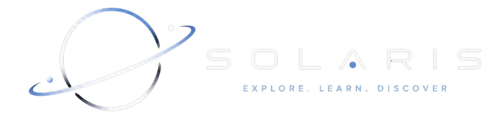

<div align="center">
  

  <br />
  
  **An interactive, highly realistic 3D Solar System experience.**

  [](https://planetzero.vercel.app/)
  [](https://github.com/sam-eer31/SolarSystem_3D-Model/releases)
</div>


## 🪐 About PlanetZero

**PlanetZero** is a modern, high-performance web application that brings the solar system right to your browser. Explore the planets with stunning 3D graphics, smooth animations, and a premium interactive interface.

Built with React and Three.js, PlanetZero uses real orbit data to visualize our cosmic neighborhood with incredible detail.

## ✨ Features

- **Interactive 3D Environment**: Orbit, pan, and zoom around the solar system.
- **High-Fidelity Models**: Features a massive highly detailed GLB model of the solar system.
- **Responsive UI**: A sleek, dark-themed, glassmorphic interface that looks amazing on any device.
- **Planet Tracking**: Focus on individual planets to explore them closely.

## 🚀 Live Demo

Experience PlanetZero right now: **[https://planetzero.vercel.app/](https://planetzero.vercel.app/)**

## 📦 Download the 3D Model

The massive, highly realistic 3D model used in this project is freely available for download. It is tracked using Git LFS due to its size.

👉 **[Download the `solar_system.glb` model from Releases](https://github.com/sam-eer31/SolarSystem_3D-Model/releases)**

> **Note**: If you are cloning this repository, make sure you have [Git LFS](https://git-lfs.github.com/) installed so the model downloads correctly!

## 💻 Tech Stack

- **Framework**: [React](https://reactjs.org/) + [Vite](https://vitejs.dev/)
- **3D Rendering**: [Three.js](https://threejs.org/) & [@react-three/fiber](https://docs.pmnd.rs/react-three-fiber/getting-started/introduction)
- **Styling**: Vanilla CSS (Custom Glassmorphism)
- **Hosting**: [Vercel](https://vercel.com)

## 🛠️ Local Development

To run PlanetZero on your local machine:

1. **Clone the repository** (make sure Git LFS is installed):
   ```bash
   git clone https://github.com/sam-eer31/SolarSystem_3D-Model.git
   cd SolarSystem_3D-Model
   ```

2. **Install dependencies**:
   ```bash
   npm install
   ```

3. **Start the development server**:
   ```bash
   npm run dev
   ```

---
<div align="center">
  <i>Crafted with ❤️ for the love of space and web development.</i>
</div>
